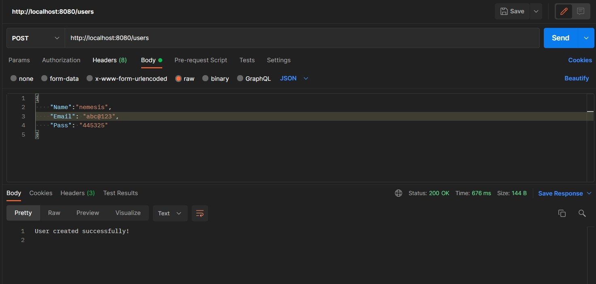
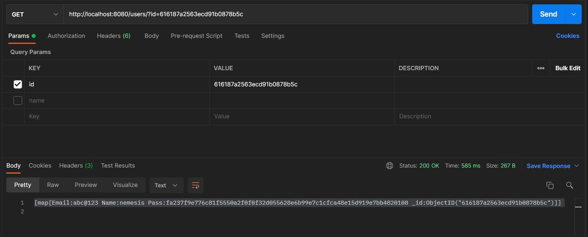
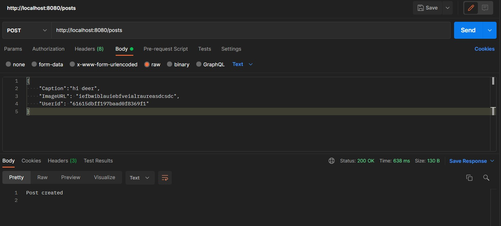
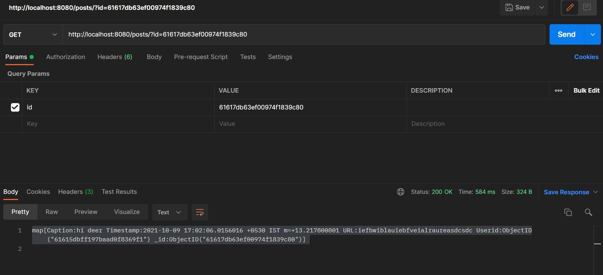

# Instagram Backend API

### An API for Intagram backend capable of adding and retrieving users and posts.

## Features:

### POST request to /users

Create a user object using name, email and password fields.
Password field is hashed and sent to mongo backend.

### GET request to /users/?id

Get any user object using the user's ID

### POST request to /posts

Create a post object using caption, image URL and userID.
A server side timestamp is generated for the post.

### GET request to /posts/?id

Get any post using the post ID.

### GET request to /posts/users/?id?lim

Get all posts of any user using the user's ID.

